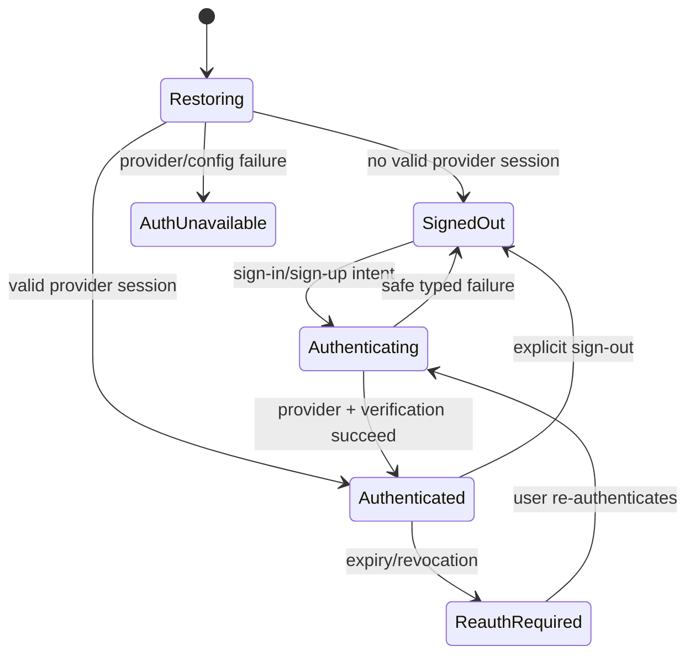
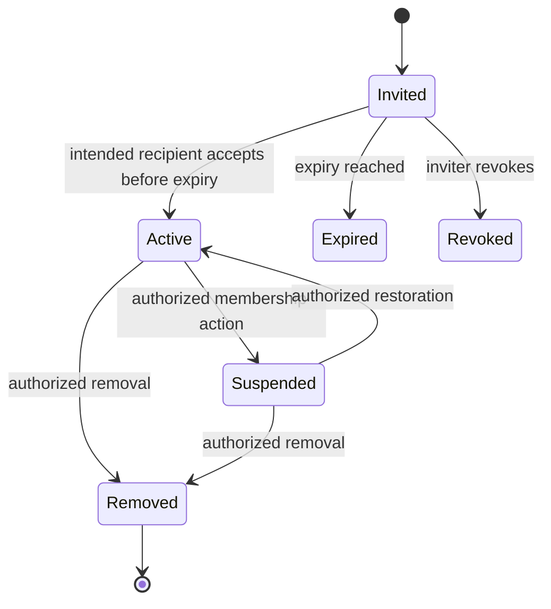

# LegalHub — Identity, Organization, and Authorization Contract

> **Status: proposal for Gate 1–3 review; not approved for production
> implementation.** This document records the next design step after the
> validated B1–B13 foundation. It does not create a Supabase schema, migration,
> RLS policy, storage policy, edge function, credential flow, or production
> configuration.

## 1. Discovery

### Goal / user outcome

Define the smallest reviewable contract for the next production slice:

- an authenticated person can establish a session without the Flutter client
  becoming an authorization authority;
- a person can belong to one or more organizations with an explicit active
  membership and organization-scoped role;
- every future organization- or matter-scoped resource has a server-enforced
  authorization path; and
- sensitive access changes are attributable and testable.

### Existing behavior and source of truth

- The B1–B13 checkpoint is tagged `bootstrap-b13` at commit `1d57e96`.
- `lib/core/auth/auth_gateway.dart` contains a deliberately credential-free
  `AuthGateway` and a synthetic `Session`.
- `lib/core/roles/user_role.dart` contains six placeholder roles and a
  capability map explicitly documented as UX-only.
- `lib/app/router.dart` redirects unauthenticated users for navigation UX only.
- `lib/app/service_locator.dart` registers only fake auth, local locale
  persistence, and console/in-memory diagnostics.
- There are no Supabase migrations, RLS policies, storage policies, RPCs,
  generated backend types, or remote repositories in this workspace.
- `INSTRUCTIONS.md` requires least privilege, tenant isolation, auditability,
  privacy by design, and server-side enforcement. It prohibits treating
  navigation guards or role strings as authorization.

### In scope for this contract

- identity/session vocabulary and lifecycle;
- organization membership and role scope;
- tenant and matter authorization boundaries;
- invitations and membership changes;
- audit-event requirements;
- RLS/storage policy design principles;
- contract/policy tests and rollout gates; and
- the sequence of implementation slices after product/security approval.

### Explicitly out of scope

- writing SQL or migrations;
- connecting the Flutter app to a Supabase project;
- collecting real credentials or real legal/client data;
- choosing a jurisdiction-specific compliance rule;
- deciding retention, legal hold, deletion, residency, or e-discovery policy;
- implementing matters, documents, messages, payments, conflicts, waivers,
  ethical walls, filings, AI, or analytics;
- platform-admin impersonation/support access; and
- claiming regulatory compliance or legal sufficiency.

### Data and risk classification

Identity data is personal data. Organization membership is access-control data.
Future matters, documents, messages, filings, and conflict information are
sensitive legal/matter data. Sessions and reset tokens are credentials or
credential-adjacent data. This is a high-risk security/privacy design change;
Gate 3 approval is required before implementation.

## 2. Non-negotiable security contract

1. **Default deny.** A request is denied unless the server can derive a valid
   authenticated actor, active organization membership, and resource scope.
2. **Server authority.** The Flutter client may request an action and render
   the returned policy result, but it cannot grant itself a role, organization,
   membership, owner, approval, audit record, or status.
3. **Tenant isolation.** An organization ID supplied by a client is a routing
   hint only. The server must compare it with membership and resource ownership
   before returning or mutating data.
4. **No role-only matter access.** An organization role never automatically
   grants access to every matter or confidential object. Matter membership,
   assignment, explicit policy, or a reviewed server operation is required.
5. **No client secrets.** A Flutter build may receive only the approved public
   Supabase URL/anon configuration through build-time environment injection.
   Service-role keys and privileged credentials belong only in controlled
   server/edge-function environments.
6. **No sensitive diagnostics.** Do not log passwords, access/refresh tokens,
   reset tokens, document/message bodies, payment identifiers, or unnecessary
   PII. Audit references must be redacted and correlation IDs must not contain
   secrets.
7. **Explicit denial.** Expired sessions, disabled users, inactive memberships,
   missing matter scope, and policy uncertainty resolve to a distinct denied or
   re-authentication outcome—not a misleading empty success.
8. **Human accountability.** Any future consequential review, approval, waiver,
   wall, filing, or access exception needs an authorized human path and an
   append-oriented audit record. This contract does not decide the legal rule.

## 3. Proposed identity and tenant vocabulary

These are conceptual entities for review, not permission to create tables.

### 3.1 Identity

The identity provider is the intended Supabase Auth boundary. The provider owns
the authentication identity and session credentials. The application should
refer to a stable provider user ID and never treat an email address as a
permanent authorization key.

The application profile should contain only the minimum product identity data
needed by approved flows. Display names, locale, and contact details have
different privacy and retention implications and must not be copied into
diagnostics by default.

### 3.2 Organization

An organization is the primary tenant boundary for firm, team, or portal data.
Every future organization-owned row and private storage object must have a
server-derived organization scope. A user may have multiple memberships and
must be able to switch active organization context without changing the
underlying identity.

The active organization is a UI/session context, not proof of membership. Each
request must re-check membership against the server source of truth.

### 3.3 Organization membership

A membership connects an identity to an organization and contains at least:

- identity reference;
- organization reference;
- organization-scoped role;
- lifecycle status (`invited`, `active`, `suspended`, or `removed` pending
  product approval);
- created/updated timestamps; and
- actor/reference for membership changes where audit policy requires it.

There must be one unambiguous active-membership rule. A removed or suspended
membership must not authorize reads, writes, storage downloads, realtime
subscriptions, or RPC calls, even if a stale Flutter session still displays an
old role.

### 3.4 Matter and nested scope

Matters are not part of the current implementation. When approved, each matter
must belong to exactly one organization. A matter-access rule should be the
intersection of:

```text
authenticated identity
  AND active organization membership
  AND matter belongs to that organization
  AND explicit matter assignment/membership or approved organization policy
  AND object-specific policy, when applicable
```

Cross-organization IDs, guessed matter IDs, and direct object references must
return the same safe denial behavior as nonexistent or inaccessible resources
where disclosure risk requires it.

## 4. Role and permission proposal

The current six identifiers are retained as candidate vocabulary:

| Role | Candidate scope | Important limitation |
|---|---|---|
| `client` | Own profile and explicitly assigned client-facing resources | Never grants broad organization or matter access |
| `attorney` | Assigned matters and approved organization functions | Assignment and matter policy remain mandatory |
| `partner` | Organization oversight functions approved by policy | Does not imply access to every confidential document |
| `compliance_officer` | Approved organization-policy review functions | Does not imply legal clearance or unrestricted content access |
| `research_analyst` | Approved research/workspace scope | No default access to client/matter data |
| `admin` | Organization administration only if approved | “Admin” must not silently mean platform superuser |

This table is not an authorization matrix. Before implementation, product and
security owners must decide:

- whether `admin` means organization administrator, platform operator, or both;
- whether a user may hold multiple roles in one organization;
- whether organization roles differ from global/platform roles;
- who may invite, suspend, remove, and restore members;
- whether partners can see all organization metadata or only assigned scopes;
- whether compliance and research access is content-scoped, metadata-only, or
  separately approved; and
- whether clients can belong to multiple organizations.

The server should store/derive the role in the membership boundary. The client
may receive a safe capability projection for UX, but any role value in a
client request is untrusted input.

## 5. Authentication/session contract

The next auth implementation may expose these domain operations only after the
provider and product decisions are approved:

| Operation | Expected result | Safety requirements |
|---|---|---|
| Restore session | Authenticated, signed-out, expired, or unavailable | Re-check provider session; never trust cached role/membership |
| Sign up | Pending verification or authenticated session | Validate provider response; define consent and duplicate-account behavior |
| Sign in | Authenticated session or typed failure | No password/token logging; rate-limit policy belongs to provider/backend |
| Request password reset | Non-enumerating acknowledgement | Do not reveal whether an email exists; reset token stays provider-controlled |
| Verify reset OTP | Short-lived reset state or typed failure | One-time/expiry behavior must be provider-backed and tested |
| Reset password | Updated credential or typed failure | Never send password through diagnostics or app state |
| Refresh/expire | New valid session or re-authentication | Revoke/expiry behavior must invalidate protected access server-side |
| Sign out | Local and provider session termination as approved | Clear cached session context and avoid stale authorized UI |

The Flutter domain boundary should return an application `Session` without raw
Supabase DTOs, access tokens, refresh tokens, or provider exceptions. A future
session model needs a stable `userId`, display-safe identity, expiry state, and
an explicitly selected organization context; it must not contain only one
client-controlled `role` as the authority.

### Recommended auth state transitions



`Authenticated` does not mean every organization or matter request is allowed.
The resource authorization boundary remains authoritative.

## 6. Membership and invitation lifecycle

The proposed lifecycle is subject to product/security approval:



Candidate invariants:

- invitation tokens are short-lived, single-use, provider/server-controlled,
  and never stored or logged in plaintext where hashing is appropriate;
- accepting an invitation binds the authenticated identity to the intended
  organization and does not allow the client to choose a stronger role;
- invitation role and organization are server-owned values;
- revocation, expiry, suspension, and removal take effect on the next
  authorization check, not only after a client refresh;
- membership changes generate redacted audit events; and
- email enumeration, invitation forwarding, and account-linking behavior are
  explicitly tested and reviewed.

## 7. Server authorization and RLS design

Before real data exists, the backend review must identify every access path:
direct table access, views, RPCs, edge functions, realtime channels, storage
objects, exports, background jobs, and administrative tooling.

The target policy shape is default deny:

```text
request
  -> provider verifies session and derives auth.uid()
  -> membership lookup confirms active organization membership
  -> resource organization_id is derived/compared server-side
  -> matter/object scope is checked when nested
  -> role/policy permits the specific action
  -> allow; otherwise typed denial with no sensitive disclosure
```

Policy requirements:

- `SELECT` is allowed only for rows in an authorized organization/resource
  scope.
- `INSERT` derives actor, organization, ownership, and audit context server
  side; client-supplied authority fields are validated or ignored.
- `UPDATE` cannot move a row across organizations or rewrite its owner,
  approval, audit attribution, or security status through an ordinary client
  update.
- `DELETE` is not assumed to be safe: retention, legal hold, export, and
  recovery policy must be approved before destructive behavior is implemented.
- RPCs and `security definer` functions, if needed, must have a narrow contract,
  pinned search path, explicit authorization checks, and negative tests.
- Realtime subscriptions and storage policies must enforce the same scope as
  table reads; an RLS-protected table alone is insufficient.
- Signed URLs must be short-lived and issued only after server-side scope
  validation. Private object paths must not be treated as authorization.
- Service-role operations never run in the Flutter client and must not be
  reachable through an unreviewed arbitrary RPC.

## 8. Audit and privacy contract

Sensitive access and membership changes should produce append-oriented audit
records containing only what the approved retention policy permits:

- actor identity reference;
- action and outcome;
- organization and matter/resource references where appropriate;
- server timestamp;
- correlation/request ID; and
- a redacted change summary or reason code.

Do not record document/message bodies, passwords, access/refresh/reset tokens,
payment-card data, or unnecessary contact details. Audit readability and
retention are separate product decisions from audit generation. Audit records
must not become a bypass that exposes data to a role that cannot otherwise read
it.

## 9. Policy test contract

The backend test environment must use synthetic identities and at least two
organizations (`org-a`, `org-b`) with distinct memberships. Tests must cover
positive and negative paths; a passing happy path alone is not sufficient.

### Identity/session tests

- Given no valid provider session, protected data requests are denied.
- Given an expired or revoked session, refresh/re-authentication is required
  and cached organization context cannot restore access.
- Given a reset request for an unknown email, the observable response does not
  enumerate account existence.
- Given a reset token that is expired, reused, or bound to another flow, the
  operation is denied without exposing credential details.
- Given sign-out, subsequent protected requests cannot use the old session.

### Tenant and membership tests

- An active member of `org-a` can read only approved `org-a`-scoped metadata.
- The same identity cannot read, insert, update, subscribe to, or download
  `org-b` data by changing a request parameter.
- An inactive, suspended, removed, or expired membership cannot authorize any
  protected path.
- A user with two active memberships cannot access the second organization
  without selecting a valid context, and selection never bypasses membership
  checks.
- Client-supplied `organization_id`, `role`, `owner_id`, `approved_by`, and
  audit actor values cannot elevate access or cross tenant boundaries.

### Role and nested-scope tests

- Each approved role can perform only the actions in the signed-off permission
  matrix.
- An organization role without matter assignment cannot read a restricted
  matter or its document/message objects.
- A matter in `org-a` cannot be accessed by an otherwise authorized member of
  `org-b`.
- Role changes take effect on the next authorization check and leave an audit
  record; stale client capability state is not authoritative.
- A role named `admin` cannot bypass explicit platform/operator policy unless
  that separate scope is approved and separately tested.

### Storage/realtime/audit tests

- A private object cannot be downloaded with a guessed path or a stale signed
  URL after membership removal.
- A realtime subscription cannot receive events from an unauthorized
  organization or matter.
- Membership and sensitive access changes create an attributable redacted
  audit record without credentials or protected content.
- Audit readers are themselves scope-checked; an audit table is not public.

## 10. Open decisions required before implementation

The following are blockers, not assumptions to encode in code:

1. **Product model (D-02):** firm, marketplace, client portal, or combination.
2. **Jurisdiction and policy owner (D-03):** which counsel/compliance owner
   approves access, retention, consent, and high-risk workflow rules.
3. **Residency/transfers (D-04):** approved Supabase region, backups, and
   cross-border processing constraints.
4. **Retention/deletion/legal hold/export (D-05):** identity, membership,
   documents, messages, audit, and recovery behavior.
5. **Human authority (D-06):** who may grant roles, approve exceptions, and
   review access/audit events.
6. **Authentication policy:** email verification, passwordless/OTP behavior,
   MFA requirement, SSO/SCIM, account recovery, rate limits, and session TTL.
7. **Organization semantics:** who owns an organization, whether users may
   belong to multiple organizations, and how organization switching works.
8. **Role semantics:** organization versus platform roles, multi-role support,
   admin scope, and permission matrix for each approved MVP action.
9. **Invitation policy:** inviter authority, expiry, resend/revoke rules,
   identity matching, email enumeration behavior, and audit/notification rules.
10. **Support access:** whether any operator access exists; if so, require
    explicit approval, least privilege, consent/notice, time bounds, and audit.

## 11. Phased implementation proposal

No phase below should be started against production or real data without the
required approval gate.

### P0 — Decision and backend discovery

- Obtain answers to all blockers in §10.
- Obtain access to the actual non-production Supabase project and inspect its
  existing migrations, policies, functions, storage configuration, and CI
  conventions.
- Produce a signed permission matrix and data-classification/retention note.
- **Exit:** product, security, privacy, and counsel owners approve the
  identity/tenant decisions; no client or SQL code is written before this.

### P1 — Domain contracts and provider adapter

- Add domain-level authenticated session, membership summary, and typed auth
  failure contracts behind the existing `AuthGateway` seam.
- Keep Supabase DTOs and token handling inside the data adapter.
- Add unit/Cubit tests for restore, sign-in, reset, expiry, sign-out, and
  membership-context transitions using synthetic fakes.
- **Exit:** Flutter presentation cannot grant a role or bypass a denied result.

### P2 — Non-production schema and enforcement

- Write reviewed migrations for only the approved identity/profile,
  organization, membership, invitation, and audit concepts.
- Add default-deny RLS, storage, realtime, and narrow RPC policies.
- Add positive/negative policy tests with at least two organizations and
  removed/suspended memberships.
- Test rollback/backout in an ephemeral environment before any shared/staging
  deployment.
- **Exit:** policy tests prove cross-tenant denial across every access path.

### P3 — Auth and organization UX

- Implement the approved sign-in/up/recovery flows with explicit loading,
  denial, offline, expiry, and retry states.
- Implement organization selection and membership/invitation UX only for the
  signed-off actions.
- Keep navigation/capability maps labeled as UX hints and handle server denial
  distinctly.
- **Exit:** widget/integration tests cover EN/AR/TR, RTL, session expiry, and
  permission-denied behavior.

### P4 — Security review and controlled rollout

- Review threat model, dependency/configuration changes, logs, audit records,
  RLS/storage policies, and negative tests.
- Run synthetic-data staging verification and a rollback rehearsal.
- Obtain explicit release approval; do not infer production readiness from
  Flutter tests alone.

## 12. Definition of ready for the first implementation slice

The next code change is ready only when:

- this proposal is accepted or revised by product/security/privacy owners;
- all §10 blockers relevant to the selected slice have decisions;
- the actual non-production backend and migration/policy conventions are
  available;
- the permission matrix includes positive and negative cases;
- data retention/deletion and audit requirements are documented for touched
  data;
- a rollback plan exists for schema, policy, configuration, and client release;
- no production credentials or real client/legal data are used; and
- explicit implementation approval is recorded for the selected phase.

Until then, the recommended executable action is **P0 decision capture and
backend discovery**, not adding a Supabase package or modifying RLS.